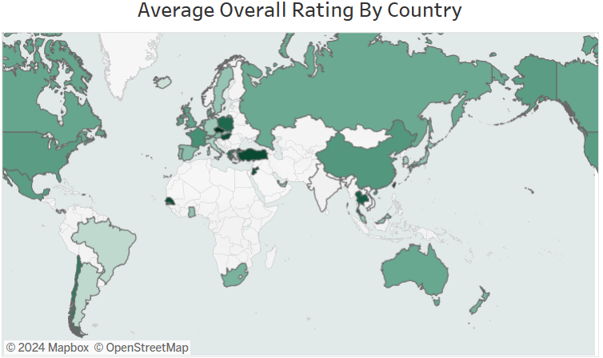
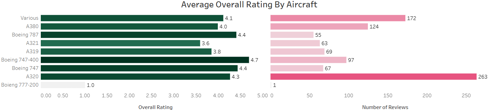

# British Airways Review (Analysis)

## 1. Background and Overview

The airline industry constantly strives to improve passenger satisfaction, and customer reviews provide valuable insights into areas for improvement. This project focuses on analyzing reviews for **British Airways** to better understand customer satisfaction across multiple categories like cabin staff, in-flight entertainment, food, and ground services.

Using Tableau, an interactive dashboard has been created to visualize these reviews, offering insights into various metrics and customer experiences. This analysis is aimed at helping British Airways refine their services and provide data-driven recommendations for improving the customer journey.

The dataset consists of multiple variables, including customer ratings, service type, traveler information, and more, making it a rich source for understanding the factors that drive customer satisfaction.

---

## 2. Data Structure Overview

The dataset utilized in this analysis includes the following key variables:

- **Rating**: Customer’s overall rating of their experience.
- **Cabin Staff Service**: Rating of the cabin staff's performance.
- **Entertainment**: Rating of the in-flight entertainment options.
- **Food and Beverages**: Rating of food and beverages.
- **Ground Service**: Rating of services provided on the ground.
- **Month of Date**: Month when the review was given.
- **Traveler Type**: Type of traveler (e.g., business, leisure).
- **Seat Type**: Type of seating (economy, business class, etc.).
- **Aircraft**: The type of aircraft flown.
- **Continent**: The continent the flight took place in.

This data is visualized through multiple filters, including cabin staff, entertainment, food, month of date, traveler type, seat type, aircraft, and continent, providing a holistic view of customer satisfaction.

---

## 3. Executive Summary

This project presents a comprehensive analysis of customer reviews for British Airways. The visualization allows users to filter insights based on multiple parameters such as service quality, traveler type, seating class, and more. Key highlights from the analysis include:

- **Overall Rating Trends**: 
  - A line graph showing the **average overall rating by month** reveals how customer satisfaction fluctuates over time.  
  - The data highlights peak and low points during the year, offering opportunities for understanding factors contributing to changes in customer experience.

- **Geographical Insights**: 
  - A map visualizes the **average overall rating by country**, identifying regions where British Airways performs exceptionally well or needs improvement.
  

- **Aircraft Type Performance**:
  - A bar chart demonstrates the **average overall rating by aircraft type** and is further segmented by the number of reviews, helping identify top-performing and underperforming aircraft.
  

---

## 4. Insights Deep Dive

### 1. Overall Rating by Month
- The **line graph** displays how the average customer rating fluctuates by month, allowing a clear view of trends throughout the year.
- Key months with **higher or lower customer satisfaction** can be observed, which might correlate with seasonal traffic, operational factors, or promotions.

### 2. Geographic Distribution of Ratings
- The **map visualization** highlights average ratings across different countries.
- By analyzing geographic data, British Airways can identify **regional strengths and weaknesses**, guiding efforts to improve customer satisfaction in specific countries.

### 3. Aircraft Type Performance
- The **bar chart** illustrates average ratings based on the type of aircraft flown.
- The analysis indicates certain aircraft types receiving consistently higher ratings than others. This insight could help focus efforts on improving the passenger experience in aircraft that have lower ratings.

### 4. Service Ratings Breakdown
- Multiple service-related metrics such as **Cabin Staff Service, Entertainment, Food and Beverages, and Ground Service** are visualized, showing how each of these factors contributes to the overall rating.
- This data enables British Airways to **target improvements** in specific service areas that receive lower ratings.

---

## 5. Recommendations

Based on the insights derived from the analysis, the following recommendations are provided for British Airways to enhance customer satisfaction and service quality:

1. **Service Quality Improvements**:
   - Focus on improving the **Food and Beverage** and **Entertainment** offerings, as these services have a noticeable impact on overall customer ratings.

2. **Aircraft Optimization**:
   - Certain aircraft models consistently receive lower ratings. British Airways should investigate whether these aircraft have **outdated amenities** or **service-related issues** and take corrective action.

3. **Regional Customization**:
   - Regions with lower customer satisfaction, as identified in the map, should receive **tailored service enhancements** based on regional preferences or customer feedback.

4. **Seasonal Staffing Adjustments**:
   - Review **monthly fluctuations** in ratings and consider adjusting staffing levels or operational strategies during high-traffic periods to maintain consistent service quality throughout the year.

5. **Traveler-Type Focused Offers**:
   - Analyzing satisfaction levels by **traveler type** reveals different needs for business versus leisure travelers. Introducing customized offerings for each traveler type can improve customer loyalty.

---

## Conclusion

The **British Airways Review (Analysis)** project provides a detailed look into the factors that drive customer satisfaction. By analyzing overall ratings across various dimensions—such as month, aircraft type, and region—this report highlights key areas for service improvement. The insights gained from this project offer actionable recommendations for enhancing customer experience, ensuring consistent service quality, and increasing customer retention in the highly competitive airline industry.

---

## Visualizations and Filters
- **Filters**: Six filters for analyzing metrics across Cabin Staff, Entertainment, Food, Month, Traveler Type, Seat Type, Aircraft, and Continent.
- **Key Visuals**: Average ratings across months, countries, and aircraft types visualized using line graphs, maps, and bar charts.

---

## Tableau Public Link

You can view the interactive visualization on Tableau Public: [British Airways Review Analysis](https://public.tableau.com/shared/3KS3NCQTG?:display_count=n&:origin=viz_share_link)

